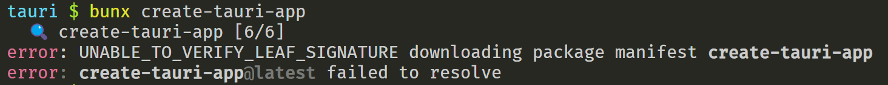

### UNABLE_TO_VERIFY_LEAF_SIGNATURE

bun 安装软件包报错 `UNABLE_TO_VERIFY_LEAF_SIGNATURE`, 在[https://bun.sh/blog/bun-v1.0.1](https://bun.sh/blog/bun-v1.0.1)博客中提到了解决方案, 添加环境变量`NODE_TLS_REJECT_UNAUTHORIZED=0`禁用TLS验证即可

