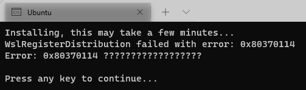
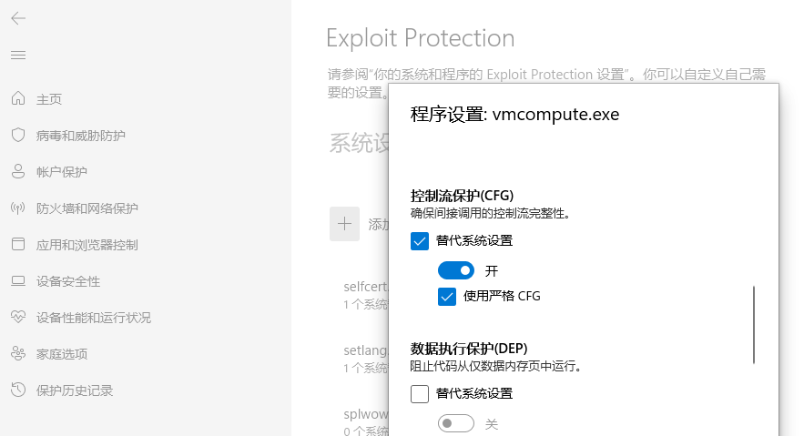
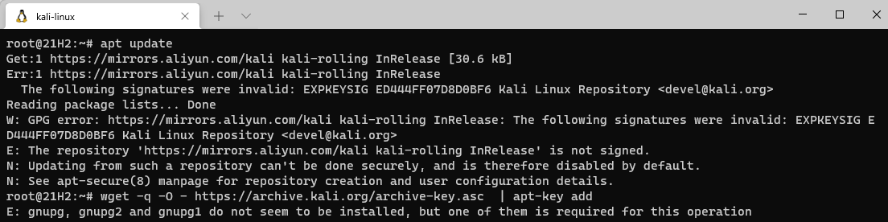

## 0x80370114错误 

`wsl --install` 命令自动配置 wsl 所需环境, 默认安装 ubuntu, 其他发行版需要通过 -d 选项指定

重启后无法正常运行, 错误代码为 0x80370114

github 上有相关 issues: https://github.com/microsoft/WSL/issues/4626

需要在 Windows 安全中心 --> 应用和浏览器控制 --> Exploit Protection --> 程序设置中对 C:\WINDOWS\System32\vmcompute.exe 添加CFG, 并替代系统设置

然后 net start vmcompute 启动该服务即可正常运行 wsl

## wsl kali-linux 更新源错误

安装 kali-linux 后 apt-get 无法更新

从 https://http.kali.org/kali/pool/main/k/kali-archive-keyring/ 下载 kali-archive-keyring_2020.2_all.deb 安装后即可正常更新系统
